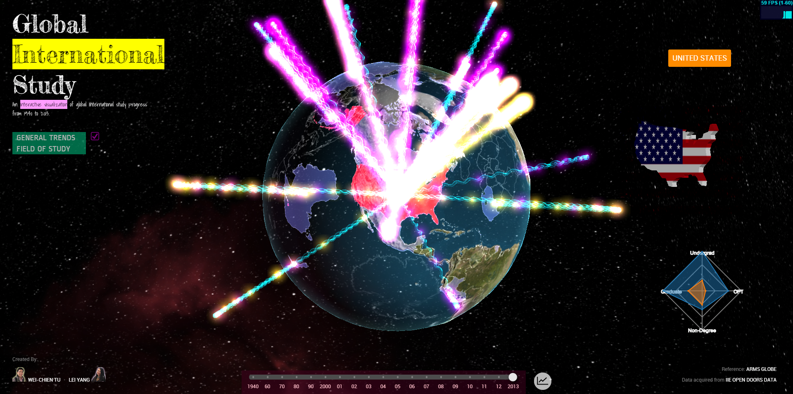
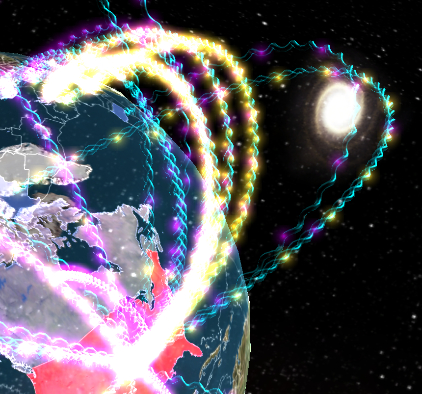
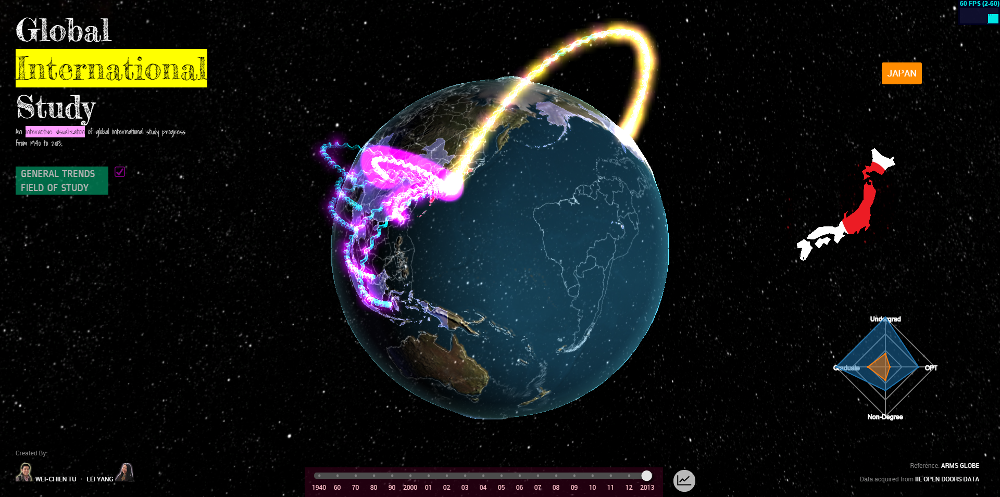
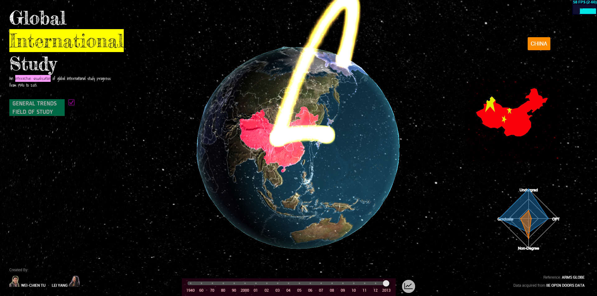
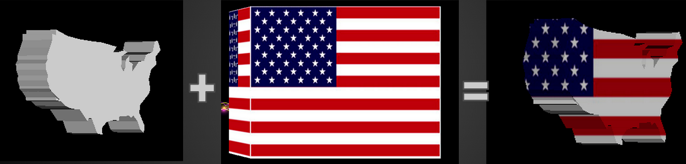
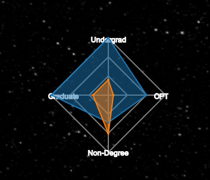
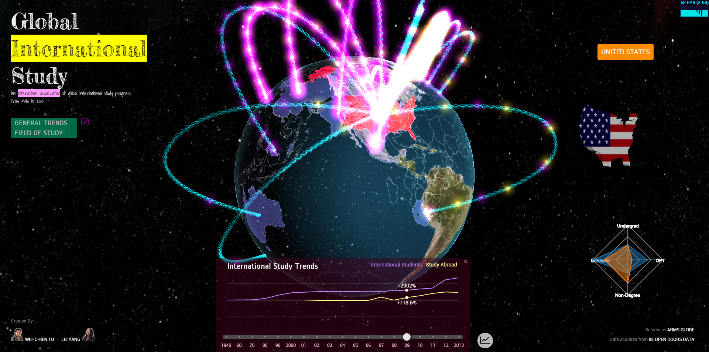
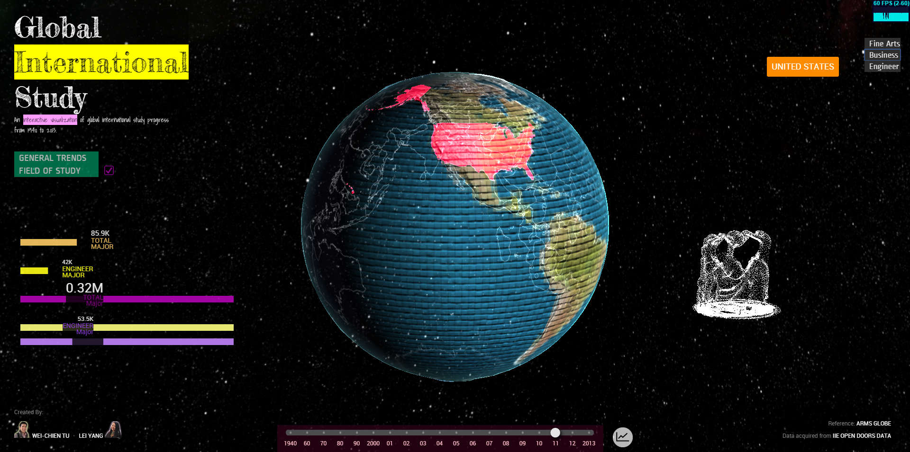
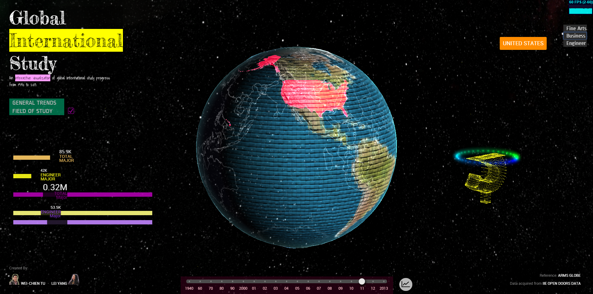
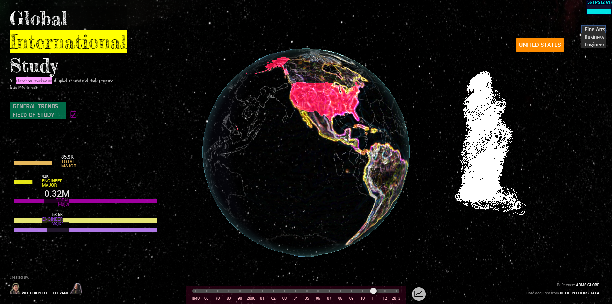

GPU-FinalProject
================
11/24/2014, Update

####Alpha Features:

* 3D Interactive Globe
  - Three.js, GLSL shaders
  - Features for alpha: 
    - Transparent globe with bumping map, rim, country outline
    - Country selection
    - Spiral line connections (basic)
    - Country Obj (test)
    - Area of study Obj (test)
* 2D UI
  - D3.js, html & css
  - Features for alpha:
    - history timeline
    - selected country name

===================
12/1/2014, Update

Beta Version Demo: http://foxking0416.github.io/GPU-FinalProject/

####Beta Features:
* 3D Interactive Globe (Three.js + GLSL)
  - Spiral Line Pipe
  - Objloader
  - Skybox
  - Particle Animation
  - Country Obj meshes (5 main countries)
* 2D UI (D3.js)
  - Bar graphs
  - Field of study switch buttons
  - History Diagram

12/7/2014 , Update
* 3D Interactive Globe (Three.js + GLSL)
  - Spiral Line Pipe
  - Objloader
  - Skybox
  - Particle Animation
  - Country Obj meshes (10 main countries)
  - Obj vertices display and animations
  - Obj vertices interaction
* 2D UI (D3.js)
  - Bar graphs
  - Field of study switch buttons
  - History Diagram

#General Trends

* In order to show the data that students study abroad or international students come into this country, we build a spiral pipe to show this effect.
The yellow points represent students study abroad and purple points represent international students come into this country. 
The more points around a pipe means the more students population from this country. 

* By clicking different country, it will show up the data from your selecting country. 
Besides, there will be a contry name tag and country shape object with flag to tell users which coutry they just selected.
Right now we have built 9 countries geometry that could be showed(United States, China, South Korea, Japan, Inida, Vietnam, Taiwan, Turkey, Mexico)  

* We used extrusion function to extrude the shape from 2D information and then apply alpha blending with flag box. 

* The radar chart showes you the students population of each degree. We use D3.js to build this effect.  

#Field of Study mode
* When user pushed the field of study button, this page will display the population data of each study field in the left bottom corner. 
And there will be a symbolize model which could represent this field show up in the right side. In this mode, we apply different texture for different 
study field. Besides, if the user switched to different field,
then the vertices of this model will crash and drop to the ground and regenerate to become a new model. To build the vertices display, 
we used the bufferGeometry instead of Geometry in three.js to store all the vertices information including the position, normal and UVs. 
The benefit of using bufferGeometry is that it could reduce the cost of passing all this data to the GPU. However, 
the drawback is that we have to access the raw data from the appropriate attribute buffer.
After we build the bufferGeometry, then we could use THREE.Point to build all the point we need.

* The vertices crash and drop with an acceleration effect. 
To do this effect, we have to provide each vertex with drop acceleration, ground position, drop time, global time and use vertex shader to compute the desired position for each vertex.
Actually, we could also change the position attribute data in bufferGeometry which we mentioned in the last section. However, that is not done in vertex shader and will be much slower than our method.

* When all the vertices of original model converge to a single point, we instantly change the model to another one and also inflate it to become a new model.

* Just for fun!!  
User could use number keys from '1' to '5' to blow the vertices of the model from its initial position. 
Each number key could blow differnt part of the model and the blow direction is the camera direction.
To achieve this effect, we have to assign each vertex with different blow time and blow direction, then use the specific vertex shader to compute the position for each vertex.

* By pushing 'b', user could blow the entire the model at one time. 

#Video
http://youtu.be/mhCQRrjc6zM
