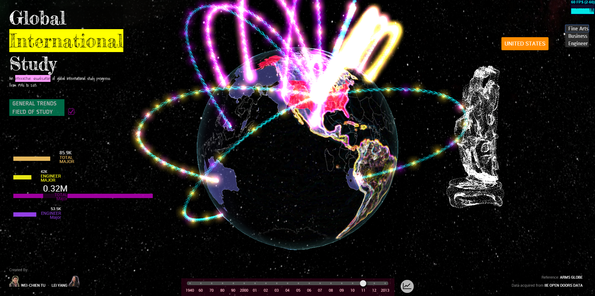

GPU-FinalProject
================
11/24/2014, Update

####Alpha Features:

* 3D Interactive Globe
  - Three.js, GLSL shaders
  - Features for alpha: 
    - Transparent globe with bumping map, rim, country outline
    - Country selection
    - Spiral line connections (basic)
    - Country Obj (test)
    - Area of study Obj (test)
* 2D UI
  - D3.js, html & css
  - Features for alpha:
    - history timeline
    - selected country name

===================
12/1/2014, Update

Beta Version Demo: http://foxking0416.github.io/GPU-FinalProject/

####Beta Features:
* 3D Interactive Globe (Three.js + GLSL)
  - Spiral Line Pipe
  - Objloader
  - Skybox
  - Particle Animation
  - Country Obj meshes (5 main countries)
* 2D UI (D3.js)
  - Bar graphs
  - Field of study switch buttons
  - History Diagram

12/7/2014 , Update
* 3D Interactive Globe (Three.js + GLSL)
  - Spiral Line Pipe
  - Objloader
  - Skybox
  - Particle Animation
  - Country Obj meshes (10 main countries)
  - Obj vertices display and animations
  - Obj vertices interaction
* 2D UI (D3.js)
  - Bar graphs
  - Field of study switch buttons
  - History Diagram

#General Trends

#Field of Study
* When user pushed the field of study button, this page will display the population data of each study field in the left bottom corner. 
And there will be a symbolize model which could represent this field show up in the right side. If the user switch to different field, 
then the vertices of this model will crash and drop to the ground and regenerate to become the new model. To build the vertices display, 
we used the bufferGeometry in three.js to store all the vertices information including the position, normal and uvs.

#Video
http://youtu.be/mhCQRrjc6zM
