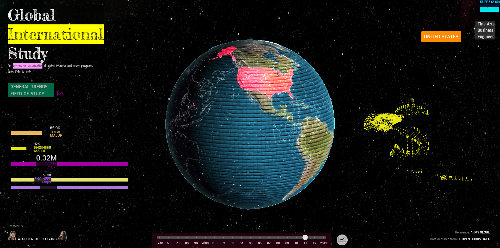

Interactive Globe: Global International Study
================
####CIS 565: GPU Programming - Final Project - 2014 Fall - University of Pennsylvania

####Authors:
* Wei-Chien Tu
  - foxking0416@gmail.com
  - https://github.com/foxking0416
* Lei Yang 
  - radiumyang@gmail.com
  - http://lovelessrara.wix.com/leiyang
  - https://github.com/radiumyang

####Lei Yang
================
11/24/2014, Update

####Alpha Features:

* 3D Interactive Globe
  - Three.js, GLSL shaders
  - Features for alpha: 
    - Transparent globe with bumping map, rim, country outline
    - Country selection
    - Spiral line connections (basic)
    - Country Obj (test)
    - Area of study Obj (test)
* 2D UI
  - D3.js, html & css
  - Features for alpha:
    - history timeline
    - selected country name

===================
12/1/2014, Update

Beta Version Demo: http://foxking0416.github.io/GPU-FinalProject/

####Beta Features:
* 3D Interactive Globe (Three.js + GLSL)
  - Spiral Line Tube
  - Objloader
  - Skybox
  - Particle Animation
  - Country Obj meshes (5 main countries)
* 2D UI (D3.js)
  - Bar graphs
  - Field of study switch buttons
  - History Diagram

===================
12/7/2014 , Update
 
 #### Final Features:
* 3D Interactive Globe (Three.js + GLSL)
  - Spiral Line Tube
  - Objloader
  - Skybox
  - Particle Animation
  - Country Obj meshes (10 main countries)
  - Obj vertices display and animations
  - Obj vertices interaction
* 2D UI (D3.js)
  - Bar graphs
  - Field of study switch buttons
  - History Diagram

 #### Final Presentation Slides:
* https://docs.google.com/presentation/d/1Jv2kuLtRkd-uKbQByFJf72L96bNAwOkvRSUU-BDX1vA/edit?usp=sharing

#General Trends
* This project is a data visualization webGL application of global international study trends from 1940s to 2013.
We have two mode in this web page and the first mode is the general trends which could show the data that students study abroad or international students come into this country.

* The yellow points represent students study abroad and purple points represent international students come into this country. 
The more points around a tube means the more students population from this country. Both the tube and points are built by using three.js library. 
To build the tube, we have to build the bezier curve first and then use this curve as the central axis to extrude the tube. 
To build the point, we use the position on the bezier curve every certain period and then using THREE.PointCloud to build them.  

* By clicking different country, it will show up the data from your selecting country. 
Besides, there will be a country name tag and country shape object with flag to tell users which coutry they just selected.
Right now we have built 9 countries geometry that could be shown(United States, China, South Korea, Japan, Inida, Vietnam, Taiwan, Turkey, Mexico)  

* We used extrusion function to extrude the shape from 2D information and then apply alpha blending shaders with flag box. 

* The radar chart showes you the students population of different academic levels. We use D3.js to build this effect.  

*The time line information

#Field of Study Mode (FOS Mode)
* In our project demo, we use three top areas of study to show related features: 
  - Business
  - Engineer
  - Fine Arts

* When user clicked the field of study button, three features will be displayed:
  - Bar Graph (in the left bottom corner)
  - Sand-morphing Symbolized Model
  - Different texture of the globe mesh

* Besides, if the user switched to different field,
then the vertices of this model will crash and drop to the ground and regenerate to become a new model. To build the vertices transformation effect,
we used the bufferGeometry instead of Geometry in three.js to store all the vertices information including the position, normal and UVs. 
The benefit of using bufferGeometry is that it could reduce the cost of passing all this data to the GPU. However, 
the drawback is that we have to access the raw data from the appropriate attribute buffer.
After we build the bufferGeometry, then we could use THREE.PointCloud to build all the points we need.

* The vertices will crash and drop with an acceleration when user switches to other field.  
To do this effect, we have to provide each vertex with drop acceleration, ground position, drop time, global time and use vertex shader to compute the desired position for each vertex.
Actually, we could also change the position attribute data in bufferGeometry which we mentioned in the previous section. 
However, that is not done in vertex shader and will be much slower than our current method.

* When all the vertices of original model converge to a single point, we instantly change the model to another one and also inflate all the vertices to become a new model.

* Just for fun!!  
User could use number keys from '1' to '5' to blow the vertices of the model from its initial position. 
Each number key could blow differnt part of the model and the blow direction is the camera direction (only affects x and z directions).
To achieve this effect, we have to assign each vertex with different blow time and blow direction, then use the specific vertex shader to compute the position for each vertex.

* By pushing 'b', user could blow the entire model at one time. 

* The Bar Graph dynamically shows the population data of the country in terms of different fields of study.
#Performance Analysis
* With tube/ Without tube
* With vertices model / without vertices model
* Budhha model / digger model/ dollar model

#Video
http://youtu.be/mhCQRrjc6zM

#Reference
* http://threejs.org/
* http://armsglobe.chromeexperiments.com/
